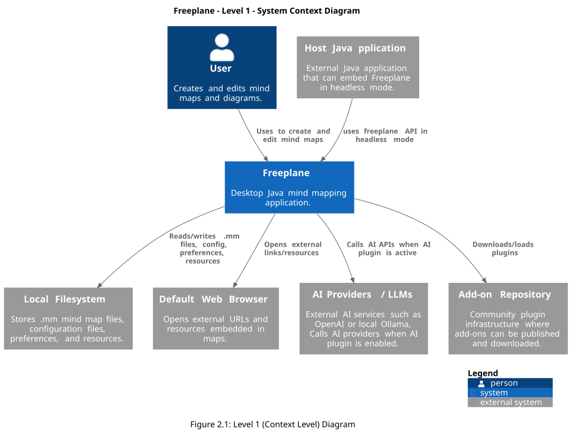
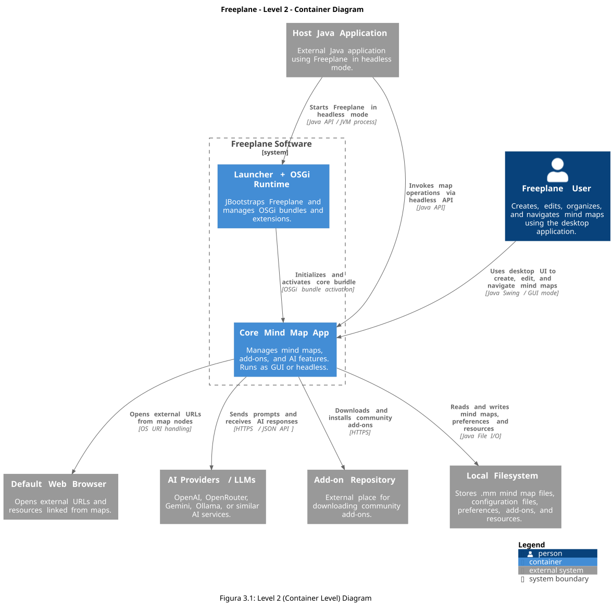
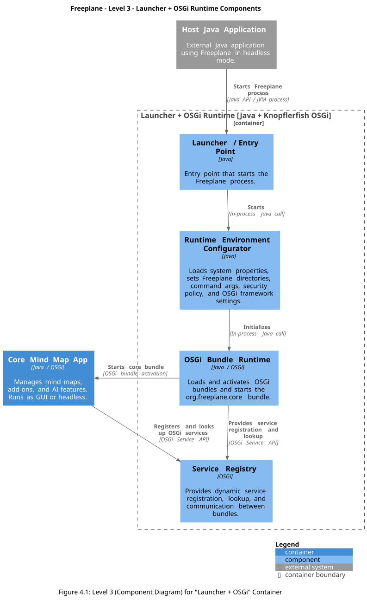
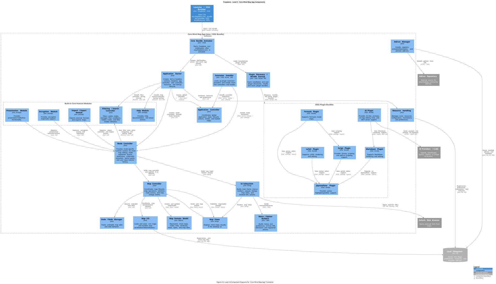

# Architectural Analysis
## 1. Architecture Overview
**Freeplane** features a **modular architecture based** on the **OSGi Framework**, which transforms a monolithic Java application into separate bundles. These can be installed, started, stopped, updated, and uninstalled at runtime without restarting the application.

To achieve this, OSGi relies on three layers:
1.	**Bundle:** contains the code and metadata (dependencies, version);
2.	**Lifecycle:** manages the dynamic orchestration of bundles;
3.	**Service Registry:** handles sharing and discovering services dynamically.

This ensures high modularity, hot-reloading, and optimal memory efficiency.

### Tools used
All the diagrams are made using VS Code with PlantUML extension.

## 2. Context Level

In figure 2.1 you can see the **Context Level** diagram for Freeplane. Here there are all the actors and external systems that interact with the main system we focus on.

First of all we have the <strong>User</strong>, that creates and modifies the mindmaps in Freeplane, using it directly. We do not make distinctions between the normal user that uses the GUI app, the "Pro" user that uses the headless mode for scripting and automation purposes or the Developers that can freely contribute to the project since it's opensource.

Then we have the <strong>Host Java Application</strong> that permits to use Freeplane in _headless mode_ in order to connect, for instance, a Command-Line tool to create maps automatically and with the help of external scripts or AI CLIs. It communicates with Freeplane through the Freeplane's APIs.

Both of these are connected directly to the main software system, <strong>Freeplane</strong>. The main purpose of this software is to create conceptual maps.

The software then interacts with few other external systems.

First of all, it reads and writes mindmap (`.mm`) files alongside with all the resources, preferences and user's configurations in the <strong>Local Filesystem</strong>.

Then, Freeplane can handle also external resources and to do so it follows the links to them thanks to the <strong>Default Web Browser</strong>.

In some cases, whenever the "AI" Core Plugin is enabled (see chapter 3 and 4 for further details on that) the main software can call the AI APIs to connect to the external <strong>AI Providers / LLMs</strong> that run locally and expose a communication port.

Speaking of plugins, all the Core Plugins organization belongs to the main app, but we'll talk about later in chapter 4 when we'll explore the Components Level. For now, we just notice that if some additional features are needed, the app can integrate them by downloading and loading "Community Plugins" that are accessible online through the <strong>Add-on Repository</strong>.

## 3. Container Level

The figure 3.1 shows the **Container Level** for Freeplane's architecture.

Here, we can see the <strong>Freeplane</strong>'s system boundaries showing the containers inside, like we zoomed in from the figure 2.1 of the previous chapter.

Consistently, the inputs and outputs in and from these boundaries are the same as seen before.

The <strong>Host Java Application</strong> communicates with Freeplane, but now we see clearly that the link is double.
The first one with the <strong>Launcher + OSGi Runtime</strong>: they connect through APIs to start the environment and all the OSGi bundles framework.
The second one is directly with the <strong>Core Mind Map App</strong> that is effectively the container that handles the UI, the Controllers, and all the plugins structure (both the "Core" and the "Community" ones) and so works at runtime.
The <strong>User</strong> interacts directly with this last container, he never interacts directly with the launcher and doesn't know about it either. The Core Mind Map App still connects with <strong>Default Web Browser</strong>, <strong>AI Providers / LLMs</strong>, <strong>Add-on Repository</strong> and <strong>Local Filesystem</strong> in the same ways described in the previous chapter.

This structure has a strong relationship with the **Clean Architecture blueprint** representable as concentric rings. In facts, the Core Mind Map App is the innermost layer that contains the use cases. Outside, in the middle ring there are the plugins that act as connectors and translators. And the outermost layer is the infrastructure on which these layers rely on: the OSGi bundle framework.

## 4. Component Level
_This chapter will focus on the components for each of the two containers shown in the previous chapter. Then, we'll do a detailed analysis for the SOLID violations and the quality of the architecture._

### 4.1 Launcher + OSGi

The figure 4.1 shows the **component diagram for the Launcher + OSGi container**.

As you can see, the consistency with the previous level it's maintained looking at the inputs and outputs outside the container's boundaries: the <strong>Host Java Application</strong> communicates through APIs with the <strong>Launcher / Entry Point</strong> which starts the entire Freeplane process calling the <strong>Runtime Environment Configurator</strong>. Then, the <strong>OSGi Bundle Runtime</strong> it's initialized and it provides service registration in the <strong>Service Registry</strong> in order to allow the <strong>Core Mind Map App</strong> to discover them via OSGi Service APIs.

### 4.2 Core Mind Map App

The figure 4.2 shows the **component diagram for the Core Mind Map App**.

The <strong>Launcher + OSGi Runtime</strong> starts using the OSGi framework the <strong>Core Bundle Activator</strong>, which is responsible of the initialization of the main parts of the system: the <strong>Application Starter</strong>, the <strong>Plugin Discovery / Bundle Startup</strong>.

Let's start with the Application Starter first.
This component is responsible of creating the GUI or the headless mode and it then installs the most important **Built-in Core Feature Modules** such as <strong>Filtering / Search Controller</strong> and the <strong>Help Module</strong>, it creates a global <strong>Application Controller</strong>, initializes resources and preferences thanks to the <strong>Resource Handling</strong> which communicates externally with the <strong>Local Filesystem</strong>, and in the end it creates mode controllers through the mode factories in the <strong>Mode Controller</strong> big component. This one registers through Java calls the other core features that can be activated on-demand: <strong>Presentation Module</strong>, <strong>Encryption Module</strong> and <strong>Import/Export Module</strong>.
But that's not all: if the application is started in GUI Mode, then it delegates the input/output to the <strong>UI Subsystem</strong> that handles the <strong>Map Views</strong>, the <strong>Menu / Option Builders</strong> and uses OS URI and Desktop APIs to communicate with the <strong>Default Web Browser</strong>.
Then, the Mode Controller holds the main core of the application's purpose: the <strong>Map Controller</strong> which coordinates all the features regarding the map, connecting via Java calls to the <strong>Undo/Redo Manager</strong>, the <strong>Map I/O</strong> (which communicates also with the <strong>Local Filesystem</strong>), the <strong>Map Domain Model</strong> and, again, the <strong>Map Views</strong> component, that also refers to it (see chapter 4.3.4 for a deeper focus on that).

The Plugin Discovery / Bundle Startup it's a Java / OSGi Bundle API that scans installations and user plugin directories managing the **OSGi Plugin Bundles**. To help this, there is also the <strong>Extension Installer</strong> that communicates with the <strong>Application Controller</strong> and the <strong>Mode Controller</strong>, alongside with the <strong>Add-on Manager</strong> that cooperates externally with the <strong>Add-on Repository</strong> and the <strong>Local Filesystem</strong>.
Through the OSGi Bundle APIs the component discovers, installs and starts the plugin bundles. They can be a lot, counting the "Core" and the "Community" (third-party) ones. In the figure 4.2 are shown only the most important ones that are meaningful to describe the interactions between the systems or to explain the principles violations in the following chapter. That said, we then can take as examples the <strong>AI Plugin</strong> that integrates AI features into the application thanks to the HTTPS/JSON API communications with external <strong>AI Providers / LLMs</strong>. Or, we can take the examples of the <strong>Formula Plugin</strong>, <strong>LaTeX Plugin</strong>, <strong>Script Plugin</strong>, <strong>Markdown Plugin</strong> and the <strong>JSyntaxPane Plugin</strong> that are the biggest ones and that show interesting connections that will be described later in the architectural analysis. Just for completeness, there are also the <strong>SVG Plugin</strong>, the <strong>OpenMaps Plugin</strong>, the <strong>Bug Report Plugin</strong> and the <strong>Code Explorer Plugin</strong> that behave in a similar way in the OSGi bundles framework.

### 4.3 Architectural Analysis
#### 4.3.1 REP
The `freeplane_api` module strictly adheres to the **Reuse/Release Equivalence Principle (REP)** by functioning as a standalone, cohesive Gradle module. It packages all public scripting interfaces, such as `NodeRO` and similar, into a single package (`org.freeplane.api`) without internal dependencies, ensuring the granule of reuse perfectly matches the granule of release.

Conversely, a significant REP violation occurs between `freeplane_plugin_script` and `freeplane_plugin_formula`. Although the formula plugin only requires formula-related utilities, these classes (including `FormulaUtils` and `FormulaCache`) are tightly coupled inside the script plugin module. Consequently, reusing the formula evaluation engine forces an external consumer to inherit the entire `freeplane_plugin_script` module, unnecessarily dragging in heavy dependencies like Groovy and the script editor. This misalignment violates REP, as classes with distinct reuse targets are released together, tracking the same release cycle instead of being distinguished into an independent, modular granule.

#### 4.3.2 CCP
The `org.freeplane.features.filter` package perfectly exhibits **Common Closure Principle (CCP)** compliance by consolidating all elements of the filtering domain. Classes handling core data logic, user interface interactions like `FilterConditionEditor`, and execution routines like `QuickFilterAction` are contained within a single boundary. This structural unity ensures that any evolution of the filtering feature remains confined, as the components are closed together around one specific axis of change.

In stark contrast, the `org.freeplane.features.map` package represents a severe CCP violation by blending fundamentally unrelated architectural concerns. It aggregates at least four reasons to change such as domain models, controller behaviors, XML serialization components, and specialized filtering conditions, all into a single namespace. Consequently, as an example, a modification to the serialization format unnecessarily affects the same package domain that governs UI folding actions. This cohabitation forces multiple, distinct axes of change to intersect arbitrarily, undermining maintenance predictability and increasing the likelihood of unintended side effects across independent systems.

#### 4.3.3 CRP
The `org.freeplane.core.extension` package complies with the **Common Reuse Principle (CRP)** by grouping a minimal set of highly cohesive classes, such as `IExtension` and `ExtensionContainer`, which are always utilized in tandem. An external consumer requiring extension management relies on the entire package, with zero overhead from unrelated classes.

On the contrary, a severe CRP violation emerges within `freeplane_plugin_script`, again. When the formula plugin requests only formula evaluation utilities, it is forced to inherit the entire scripting module, dragging along heavy, unused parts like the script UI panel, security managers, and external Groovy runtimes. This overlap between the REP and CRP violations occurs because component principles exist in tension. While CCP pushes to group classes together for easier release management, CRP pulls them apart to minimize consumer dependencies. In our case study, Freeplane prioritizes larger release grains to simplify packaging, accepting the trade-off of a CRP violation to avoid over-splitting the codebase into numerous tiny modules.

#### 4.3.4 ADP
The system demonstrates strict **Acyclic Dependencies Principle (ADP)** compliance at the module level by enforcing a clean Directed Acyclic Graph (DAG). Every optional plugin, such as the SVG or LaTeX module, explicitly declares a compile-time dependency on the core `freeplane` project, whereas the core remains entirely unaware of the plugins. Dynamic runtime discovery is handled seamlessly through OSGi bundle activators, avoiding any architectural back-dependencies.

Conversely, a prominent ADP violation occurs at the package level within the core module itself. The `org.freeplane.features.map` controller package and the `org.freeplane.view.swing.map` view package are bound by a bidirectional dependency cycle. While `NodeView` naturally references model components, `MapController` breaks strict separation of concerns by directly importing swing view classes and constants. This cyclical dependency creates an intertwined relationship where neither package can be tested, modified, or compiled in complete isolation from the other.

#### 4.3.5 SDP
The system demonstrates **Stable Dependencies Principle (SDP)** compliance through its core architecture, where `NodeModel` serves as the primary, stable gravitational center. With 674 direct imports across 11 distinct Gradle modules, `NodeModel` remains highly dependable; its public API has matured over 15 years with negligible recent modifications. By delegating extensibility to the hyper-stable `IExtension` contract, it avoids internal volatility, ensuring that volatile plugin modules depend exclusively on a highly stable core foundation.

Conversely, a clear SDP violation occurs where `freeplane_plugin_formula` depends directly on `freeplane_plugin_script`. The scripting module is inherently unstable due to high efferent coupling, a vast concrete class surface, and volatile external dependencies like Groovy. By depending on this unstable neighbor, the formula plugin breaks the core tenant of SDP: dependencies must point in the direction of increasing stability. This improper coupling forces a fragile component to rely on an equally volatile entity, significantly increasing the risk of cascading build failures during script engine updates.

#### 4.3.6 SAP
The `org.freeplane.core.undo` package demonstrates **Stable Abstractions Principle (SAP)** compliance by balancing high stability with a solid abstractness ratio of roughly 40%. It exposes critical behavioral interfaces like `IActor` that are woven pervasively throughout the application, establishing a highly dependable contract while positioning the package safely along the architectural main sequence.

Instead, a major SAP violation plagues the `org.freeplane.features.map` package. As the absolute gravitational center of the codebase, it possesses an immense afferent coupling from plugins and secondary features, rendering it exceptionally stable. Despite this, it remains overwhelmingly concrete, with an abstractness ratio hovering around 15% and core structures like `NodeModel` and `MapController` being heavily packed with logic rather than interfaces. This combination creates a big problem, where deeply entrenched, highly coupled concrete implementations are resistant to change, generating cascading side effects and compiling obstacles whenever core data handling must evolve.

#### 4.3.7 Summary of violations and architectural quality
The structural health of the codebase displays a stark contrast between its micro-level design flaws and its macro-level architectural strengths.

Severe SOLID violations undermine the internal code quality, starting with critical **Single Responsibility Principle (SRP)** failures where massive "God classes" like `MapController` and `MapView` conflate dozens of unrelated behavioral responsibilities. **Open-Closed Principle (OCP)** vulnerabilities are apparent in factories that hardcode dozens of component wirings, though this is partially mitigated by flexible extension mechanisms. **Liskov Substitution Principle (LSP)** deviations emerge via silent behavioral changes or unimplemented methods in subclasses, while **Interface Segregation Principle (ISP)** issues remain minor, restricted to slightly bloated observer interfaces. Most critically, the **Dependency Inversion Principle (DIP)** is heavily violated by a pervasive reliance on a static global controller singleton and high-level core modules directly importing concrete swing view implementations, completely bypassing architectural abstractions.

Despite these localized object-oriented design deficiencies, the macro-level architectural qualities of the system remain highly robust in specific execution areas. The platform achieves outstanding extensibility and a sophisticated plugin architecture due to its modular OSGi bundle deployment and a well-engineered internal extension mechanism. Similarly, its configurability and core persistence frameworks—notably a clean command pattern governing undo operations—receive high marks for behavioral stability. However, internal modularity and component cohesion are significantly dragged down by the aforementioned bloated controller and view layers. This tight coupling, exacerbated by hidden global state dependencies from static singletons, ultimately cripples automated testability, forcing developers to instantiate the entire concrete controller execution stack even for isolated unit verifications.