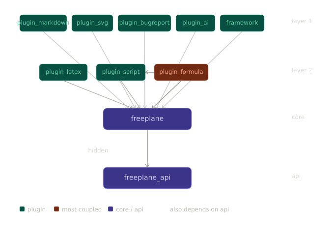

# Design Report

## 1. Dependencies

### Method

Three Python scripts were developed to analyze dependencies
in the Freeplane codebase.

**Script 1 — Code Dependency Analysis:**
A Python script scanned all 2,288 Java source files, extracting
inter-module import statements and mapping each import to its
corresponding module. This produced a complete map of which
modules depend on which others at the source code level.

**Script 2 — Knowledge Dependency Analysis:**
A second script analyzed the 1,000 most recent commits using
Git command-line tools. For each commit, the script identified
which modules contained changed files. Pairs of modules that
appeared together in the same commit were counted as co-changed,
revealing implicit knowledge dependencies not visible in source
code imports.

**Script 3 — Module-Level Co-change Analysis:**
A third script extended the knowledge dependency analysis by
grouping changed files by their parent module and counting how
often pairs of modules appeared together in the same commit,
providing a higher-level view of knowledge dependencies.

All scripts are available in the `extra-material` folder.

### Results: Code Dependencies

| Module                     | Depends On                         |
| -------------------------- | ---------------------------------- |
| freeplane_api              | — (no dependencies)                |
| freeplane                  | freeplane_api                      |
| freeplane_framework        | freeplane, freeplane_api           |
| freeplane_plugin_script    | freeplane, freeplane_api           |
| freeplane_plugin_formula   | freeplane, freeplane_plugin_script |
| freeplane_plugin_latex     | freeplane, freeplane_api           |
| freeplane_plugin_markdown  | freeplane                          |
| freeplane_plugin_svg       | freeplane                          |
| freeplane_plugin_bugreport | freeplane                          |
| freeplane_plugin_ai        | freeplane                          |

### Dependency Diagram

### Key Findings

- **freeplane_api** has no dependencies, serving as the stable
  contract layer that all other modules depend on.
- **freeplane** (core) depends only on `freeplane_api`, keeping
  its coupling minimal and allowing independent maintenance and
  testing.
- **All plugins depend on core**, but not on each other, making
  the system highly extensible — adding or removing a plugin
  does not affect any other plugin.
- **freeplane_plugin_formula** is the most coupled plugin,
  depending on both core and `freeplane_plugin_script`, justified
  by its need to execute Groovy scripts during formula evaluation.
- The overall structure follows a clean layered architecture with
  no circular dependencies.

### Analysis

#### Why these dependencies exist

Freeplane follows a layered architecture designed to maximize
modularity and minimize coupling. `freeplane_api` defines the
public interfaces that all modules rely on, ensuring that plugins
never depend on internal implementation details. This is
consistent with the Dependency Inversion Principle: both the
core and the plugins depend on the abstraction layer, not on
each other's internals.

`freeplane_framework` depends on both `freeplane` and
`freeplane_api` because it coordinates application startup and
plugin lifecycle, requiring access to both the API contracts and
the core implementation through the OSGi framework.

All plugins depend on core because they extend its functionality.
For example, `freeplane_plugin_script` requires access to the
node model to manipulate mind maps through Groovy scripts, and
`freeplane_plugin_latex` needs node content to render LaTeX
formulas. This is confirmed directly in the source code:
[Activator.java](https://github.com/freeplane/freeplane/blob/1.13.x/freeplane_plugin_script/src/main/java/org/freeplane/plugin/script/Activator.java)
in `freeplane_plugin_script` imports both
`org.freeplane.api.Controller` and
`org.freeplane.features.mode.ModeController`.

#### Which modules have the most dependencies and why?

`freeplane_plugin_formula` depends on both core and
`freeplane_plugin_script` because evaluating a formula may
require executing a Groovy script. `freeplane` core is the most
frequently changed module (787 out of 1,000 commits analyzed),
reflecting its central role. `freeplane_plugin_ai` is the second
most changed (217 commits), as it is a recently added feature
still under active development.

#### Which modules have the least dependencies and why?

`freeplane_api` has no dependencies by design: as the contract
layer, any dependency on another module would create a circular
dependency. Modules like `freeplane_plugin_markdown`,
`freeplane_plugin_svg`, and `freeplane_plugin_bugreport` depend
only on core because their functionality is self-contained —
they only need to read or render node content. Their low commit
frequencies (2 and 1 respectively) confirm that they are stable,
mature components.

#### Are these dependencies consistent and logical?

Yes. No circular dependencies were found. Plugins do not depend
on each other, with the single justified exception of
`freeplane_plugin_formula` depending on
`freeplane_plugin_script`. All modules depend on the API layer
rather than on internal implementations, and the layered
structure (api → core → framework → plugins) is consistently
respected across the entire codebase.

#### Impact on maintainability

Because plugins depend on the API rather than on core internals,
the core team can refactor implementation details without
breaking the plugin interface. The high change frequency of core
(787 commits) introduces a potential risk, but this is mitigated
by the stable `freeplane_api` layer: changes to core that do not
affect the API require no updates in the plugins. The active
development of `freeplane_plugin_ai` (217 commits, 44 co-changes
with core) suggests this plugin is still being deeply integrated,
and its co-change frequency is expected to decrease as it matures.

### Knowledge Dependencies (Co-change Analysis)

The commit history was analyzed using a Python script examining
1,000 recent commits out of 16,777 total.

#### Module Co-change Frequency

| Times | Module 1            | Module 2                |
| ----- | ------------------- | ----------------------- |
| 44x   | freeplane           | freeplane_plugin_ai     |
| 8x    | freeplane           | freeplane_framework     |
| 5x    | freeplane           | freeplane_plugin_script |
| 4x    | freeplane_plugin_ai | freeplane_plugin_script |
| 3x    | freeplane_api       | freeplane_plugin_script |
| 2x    | freeplane_api       | freeplane_plugin_ai     |
| 2x    | freeplane           | freeplane_api           |

#### Module Change Frequency

| Commits | Module                    |
| ------- | ------------------------- |
| 787     | freeplane (core)          |
| 217     | freeplane_plugin_ai       |
| 13      | freeplane_framework       |
| 6       | freeplane_plugin_script   |
| 4       | freeplane_api             |
| 2       | freeplane_plugin_latex    |
| 1       | freeplane_plugin_markdown |

#### Key Findings

- **freeplane** core is the most frequently changed module (787
  commits), reflecting its central role.
- **freeplane_plugin_ai** is under active development (217
  commits), explaining its high co-change frequency with core.
- Most knowledge dependencies are consistent with code
  dependencies — modules that import each other tend to change
  together.

#### Inconsistencies between Code and Knowledge Dependencies

- `freeplane_api` and `freeplane_plugin_script` co-changed 3
  times despite no direct import relationship, suggesting a
  **hidden dependency**: API changes sometimes require adjustments
  in the script plugin.
- `freeplane_plugin_ai` and `freeplane_plugin_script` co-changed
  4 times with no code dependency, possibly indicating shared
  behavioral assumptions.

## 2. Patterns

Freeplane incorporates a highly structured architectural framework designed to handle the complex structural and interactive requirements of mind-mapping software. At a macroscopic level, the codebase enforces a strict separation of concerns by adopting the Model-View-Controller (MVC) architectural pattern, which partitions the system into three interconnected layers:

- **Model:** Encapsulates the structural topology of the mind map as a pure data tree. Domain classes track node text, attributes, and graph hierarchies without maintaining any awareness of presentation or visual coordinates.
- **View:** Built upon the Java Swing framework, this layer isolates the intricate spatial and layout calculations required for map visualization, translating abstract graph topology into concrete graphical coordinates based on zoom levels and folding states.
- **Controller:** Manages user input loops, high-frequency command mapping, and drag-and-drop mechanics. It is heavily optimized for a keyboard-first interaction model, ensuring that state updates propagate safely without leaking view dependencies.

To complement this foundation, Freeplane utilizes an event-driven subsystem based on asynchronous and synchronous event propagation. When a data property is updated within a node, the Model acts as an event publisher, broadcasting structural delta packages across a centralized event bus. This architectural layout allows presentation views, search indexers, and peripheral plugins to synchronize their internal state simultaneously and independently, eliminating structural fragility and ensuring long-term system maintainability.

### 2.1. Structural Patterns: Composite

Building directly upon its hierarchical data foundation, Freeplane resolves the challenge of uniform tree manipulation by implementing the Composite design pattern within the core class [org.freeplane.features.map.NodeModel](https://github.com/freeplane/freeplane/blob/1.13.x/freeplane/src/main/java/org/freeplane/features/map/NodeModel.java). 

**Problem Solved:**
In any mind-mapping tool, nodes exist in fluid states, acting either as simple terminal entries enclosing short text strings or as macro-branches encompassing deep, nested sub-trees. If the system separated these constructs into distinct physical types, caller subsystems would be forced to execute persistent type-checking routines (e.g., `if (node instanceof Branch)`), polluting the business logic. The Composite pattern solves this by allowing client subsystems to treat individual nodes and entire branches in a completely uniform manner.

**Roles Mapping in Code:**
- **Component:** The [NodeModel](https://github.com/freeplane/freeplane/blob/1.13.x/freeplane/src/main/java/org/freeplane/features/map/NodeModel.java#L54) class serves as the unified interface, defining common lifecycle methods like [attach()](https://github.com/freeplane/freeplane/blob/1.13.x/freeplane/src/main/java/org/freeplane/features/map/NodeModel.java#L607) and [detach()](https://github.com/freeplane/freeplane/blob/1.13.x/freeplane/src/main/java/org/freeplane/features/map/NodeModel.java#L618) for all elements in the map.
- **Composite:** [NodeModel](https://github.com/freeplane/freeplane/blob/1.13.x/freeplane/src/main/java/org/freeplane/features/map/NodeModel.java#L54) acts as a composite when it contains other nodes, managing them internally via a `private List<NodeModel> children` collection. Structural integrity and bidirectional trace are maintained through the [insert()](https://github.com/freeplane/freeplane/blob/1.13.x/freeplane/src/main/java/org/freeplane/features/map/NodeModel.java#L659) and [remove()](https://github.com/freeplane/freeplane/blob/1.13.x/freeplane/src/main/java/org/freeplane/features/map/NodeModel.java#L508) methods.
- **Leaf:** [NodeModel](https://github.com/freeplane/freeplane/blob/1.13.x/freeplane/src/main/java/org/freeplane/features/map/NodeModel.java#L54) dynamically assumes the leaf role when its children list is empty. This state is evaluated at runtime by invoking the [isLeaf()](https://github.com/freeplane/freeplane/blob/1.13.x/freeplane/src/main/java/org/freeplane/features/map/NodeModel.java#L452) method.

**Alternative & Trade-offs:**
An alternative design would involve strictly segregating the elements into explicit `LeafNode` and `BranchNode` classes implementing a unified interface.
- **Pros:** It provides stronger compile-time type safety by preventing structural insertions on terminal leaves.
- **Cons:** In fluid mind maps, leaves constantly transition into branches as users append sub-ideas. Separate classes would compel the system to constantly destroy leaf objects, instantiate branch objects, copy extensive text payloads, and re-index references. This causes severe runtime overhead and breaks command history tracking.

### 2.2. Behavioral Patterns: Observer

To cleanly propagate structural mutations from the model layer to the canvas without inducing tight dependency loops, Freeplane leverages a canonical instance of the Observer design pattern.

**Problem Solved:**
The primary challenge is updating presentation layers without hard-coding specific view coordinates inside the underlying logical model. The Observer pattern allows the core data engine to broadcast state changes to an arbitrary number of interested subsystems (such as the main map canvas, the outline view, or search indexers) without maintaining explicit references to them.

**Roles Mapping in Code:**
- **Subject:** [org.freeplane.features.map.MapModel](https://github.com/freeplane/freeplane/blob/1.13.x/freeplane/src/main/java/org/freeplane/features/map/MapModel.java) keeps a registry of subscribers and broadcasts change notifications through routines like [fireMapChangeEvent()](https://github.com/freeplane/freeplane/blob/1.13.x/freeplane/src/main/java/org/freeplane/features/map/MapModel.java#L113).
- **Observer:** [org.freeplane.features.map.INodeChangeListener](https://github.com/freeplane/freeplane/blob/1.13.x/freeplane/src/main/java/org/freeplane/features/map/INodeChangeListener.java) and [IMapChangeListener](https://github.com/freeplane/freeplane/blob/1.13.x/freeplane/src/main/java/org/freeplane/features/map/IMapChangeListener.java#L25) define the common interface and prescribed callback structures such as [nodeChanged()](https://github.com/freeplane/freeplane/blob/1.13.x/freeplane/src/main/java/org/freeplane/features/map/INodeChangeListener.java#L23).
- **Concrete Observer:** Graphical modules like [org.freeplane.view.swing.map.MapView](https://github.com/freeplane/freeplane/blob/1.13.x/freeplane/src/main/java/org/freeplane/view/swing/map/MapView.java) instantiate these listeners and catch the broadcasted events to trigger a visual `repaint()` loop.

**Alternative & Trade-offs:**
The standard alternative is Tight Coupling, where the core domain model retains direct references to visual canvas panels and directly invokes rendering updates.
* **Pros:** It provides a slight advantage in debugging transparency by making call stacks explicit and straightforward to trace.
* **Cons:** It severely violates the Single Responsibility Principle. The data model would become directly dependent on Java Swing components, making it impossible to perform headless operations, execute rapid unit tests, or run command-line batch file exports on a server without loading the graphical user interface.

---

### 2.3. Behavioral Patterns: Command

Managing the temporal tracking of observations and changes requires a fully reversible document lifecycle, a requirement solved by integrating the Command design pattern.

**Problem Solved:**
Directly modifying a mind map's state via UI controllers strips the system of transactional memory, making it impossible to implement an Undo/Redo mechanism. The Command pattern solves this problem by reifying user requests into standalone transaction objects that encapsulate all the context needed to execute or reverse an action.

**Roles Mapping in Code:**
- **Command:** The [org.freeplane.core.undo.IActor](https://github.com/freeplane/freeplane/blob/1.13.x/freeplane/src/main/java/org/freeplane/core/undo/IActor.java) interface defines the abstract command layer, detailing execution and rollback parameters through its `act()` and `undo()` methods.
- **Concrete Command:** Domain actions like [ChangeBaseHGapActor](https://github.com/freeplane/freeplane/blob/1.13.x/freeplane/src/main/java/org/freeplane/features/nodelocation/mindmapmode/ChangeBaseHGapActor.java) implement `IActor`, storing references to the targeted node along with the state delta (previous and new values) to enable precise rollback capabilities.
- **Invoker:** [org.freeplane.core.undo.UndoHandler](https://github.com/freeplane/freeplane/blob/1.13.x/freeplane/src/main/java/org/freeplane/core/undo/UndoHandler.java) acts as the history manager, holding an ordered `LinkedList` of executed actions and tracking the timeline cursor via an iterator.
- **Macro Command optimization:** The [CompoundActor](https://github.com/freeplane/freeplane/blob/1.13.x/freeplane/src/main/java/org/freeplane/core/undo/CompoundActor.java) class holds a nested list of independent commands, allowing high-density batch modifications to execute or reverse as a single unified action.

**Alternative & Trade-offs:**
The natural design alternative for capturing historical changes is the Memento pattern.
- **Pros:** Low implementation complexity, as it simply saves complete document state snapshots.
- **Cons:** It is profoundly memory-inefficient for large graphical trees. Serializing full duplicates of a mind map with thousands of nodes for every single character edit would instantly exhaust the Java Virtual Machine heap memory, whereas the Command pattern preserves only minimal execution deltas.

### 2.4. Creational Patterns: Singleton

Orchestrating these distinct architectural subsystems requires a reliable structural anchor that provides global access without sacrificing thread safety or data coherence.

**Problem Solved:**
Complex desktop applications require global references to orchestrate application-wide services such as configuration stores, active view managers, and selection models. If every object had to receive these managers through constructor injection, it would result in deep, unmanageable dependency chains ("spaghetti code").

**Roles Mapping in Code:**
- **Singleton & Registry:** The class [org.freeplane.features.mode.Controller](https://github.com/freeplane/freeplane/blob/1.13.x/freeplane/src/main/java/org/freeplane/features/mode/Controller.java) restricts its own instantiation by holding a unique global reference within [`private static Controller currentController`](https://github.com/freeplane/freeplane/blob/1.13.x/freeplane/src/main/java/org/freeplane/features/mode/Controller.java#L243).
- **Global Access Gateway:** Client classes retrieve the shared instance via the [`public static getCurrentController()`](https://github.com/freeplane/freeplane/blob/1.13.x/freeplane/src/main/java/org/freeplane/features/mode/Controller.java#L244) method. 
- **ThreadLocal Variation:** To ensure safety during background multithreading, the access routine integrates a `ThreadLocal` constraint ([`threadController.get()`](https://github.com/freeplane/freeplane/blob/1.13.x/freeplane/src/main/java/org/freeplane/features/mode/Controller.java#L245)). This checks if the calling thread possesses a dedicated local context before falling back to the global instance, allowing worker threads to execute asynchronous background scripts without risking state corruption.

**Alternative & Trade-offs:**
An alternative approach is using a Dependency Injection (DI) framework such as Spring or Google Guice.
- **Pros:** Highly improves testability by allowing mock controllers to be injected into independent modules, making class dependencies completely explicit.
- **Cons:** Introducing a DI engine into a legacy desktop application requires massive architectural refactoring. It adds significant runtime initialization overhead for an environment where a solitary global context is already naturally mandated by the single-user nature of desktop execution.

### 2.5. Creational Patterns: Abstract Factory

Finally, Freeplane isolates platform-dependent generation constraints and execution conditions by leveraging the Abstract Factory design pattern.

**Problem Solved:**
Because Freeplane is designed to run across diverse system configurations, it must decouple abstract structural logic from concrete environmental limitations. For example, when running as a visual desktop application, node icons must map to visual graphics structures. However, if Freeplane runs via command-line scripts for automated server processing, accessing visual graphics subsystems triggers terminal server crashes and throws graphic-server exceptions.

**Roles Mapping in Code:**
- **Abstract Factory:** The interface [org.freeplane.features.icon.factory.IconFactory](https://github.com/freeplane/freeplane/blob/1.13.x/freeplane/src/main/java/org/freeplane/features/icon/factory/IconFactory.java) declares abstract creation methods for generating map icons.
- **Concrete Factories:** [`GraphicIconFactory`](https://github.com/freeplane/freeplane/blob/1.13.x/freeplane/src/main/java/org/freeplane/features/icon/factory/GraphicIconFactory.java) handles standard GUI rendering, while [`HeadlessIconFactory`](https://github.com/freeplane/freeplane/blob/1.13.x/freeplane/src/main/java/org/freeplane/features/icon/factory/HeadlessIconFactory.java) handles headless command-line execution contexts.
- **Product:** Abstract icon wrappers (e.g., `UIIcon`) returned by the factory methods. During headless terminal execution, the factory returns lightweight, invisible dummy frames that require zero hardware support, preventing application crashes.

**Alternative & Trade-offs:**
The absolute alternative to this factory design is Direct Instantiation (e.g., calling `new ImageIcon(...)` directly inside the node classes).
- **Pros:** It eliminates abstraction boilerplate code and reduces the total number of system interfaces.
- **Cons:** It hard-codes graphic frameworks into the data logic, violating the Dependency Inversion Principle and totally ruining structural portability across non-GUI platforms or automated testing pipelines.
## 3. Summary

_(To be completed)_
