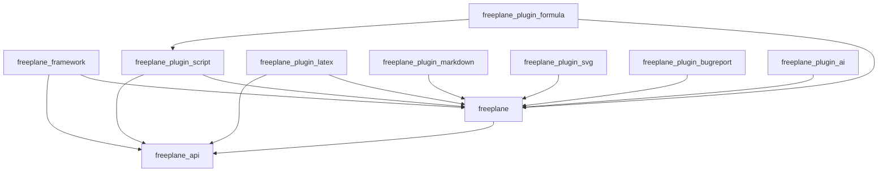

# Design Report

## 1. Dependencies

### Method

Three Python scripts were developed to analyze dependencies
in the Freeplane codebase:

**Script 1 — Code Dependency Analysis:**
A Python script scanned all 2,288 Java source files across
the Freeplane modules, extracting inter-module import
statements. For each `.java` file, all lines starting with
`import org.freeplane` were collected and mapped to their
corresponding module. This allowed us to build a complete
map of which modules depend on which others at the source
code level.

**Script 2 — Knowledge Dependency Analysis:**
A second Python script used Git command-line tools to analyze
the commit history of the repository. For each of the 1,000
most recent commits, the script identified which modules
contained changed files. Pairs of modules that appeared
together in the same commit were counted as co-changed,
revealing implicit knowledge dependencies that do not
appear in the source code imports.

**Script 3 — Module-Level Co-change Analysis:**
A third Python script extended the knowledge dependency
analysis to the module level. Instead of tracking individual
files, it grouped changed files by their parent module and
counted how often pairs of modules appeared together in the
same commit. This provided a higher-level view of knowledge
dependencies across the entire system.

All scripts are available in the `extra-material` folder
of this repository.

### Results: Code Dependencies

| Module                     | Depends On                         |
| -------------------------- | ---------------------------------- |
| freeplane_api              | — (no dependencies)                |
| freeplane                  | freeplane_api                      |
| freeplane_framework        | freeplane, freeplane_api           |
| freeplane_plugin_script    | freeplane, freeplane_api           |
| freeplane_plugin_formula   | freeplane, freeplane_plugin_script |
| freeplane_plugin_latex     | freeplane, freeplane_api           |
| freeplane_plugin_markdown  | freeplane                          |
| freeplane_plugin_svg       | freeplane                          |
| freeplane_plugin_bugreport | freeplane                          |
| freeplane_plugin_ai        | freeplane                          |

### Dependency Diagram

The following diagram shows the code dependencies between
the main Freeplane modules, based on the import analysis:

### Key Findings

- **freeplane_api** is the base module with no dependencies,
  serving as the stable contract layer that all other modules
  depend on. This design ensures that the public interface
  remains independent and cannot be broken by changes in
  other modules.

- **freeplane** (core) depends only on `freeplane_api`,
  keeping its coupling minimal. This allows the core to be
  maintained and tested independently from all plugins,
  which is essential given that it is the most frequently
  changed module in the repository (787 out of 1,000 commits).

- **All plugins depend on the core module**, but not on each
  other. This one-directional dependency structure means that
  adding, removing, or modifying a plugin does not affect
  any other plugin, making the system highly extensible.

- **freeplane_plugin_formula** has the most dependencies
  among all plugins, depending on both `freeplane` core and
  `freeplane_plugin_script`. This makes it the most coupled
  module in the system, though this coupling is justified by
  its need to evaluate formulas through the scripting engine.

- The overall dependency structure follows a clean layered
  architecture with no circular dependencies, which is a
  strong indicator of good software design and long-term
  maintainability.

### Analysis

#### Why these dependencies exist

The architecture of Freeplane follows a clear layered structure
designed to maximize modularity and minimize coupling between
components. This structure reflects deliberate design decisions
made by the Freeplane development team to ensure long-term
maintainability and extensibility of the system.

`freeplane_api` sits at the foundation and defines the public
interfaces that all other modules rely on. This design decision
ensures that plugins never depend directly on internal
implementation details, but only on stable, well-defined
interfaces. This makes it possible to change the core
implementation without breaking the plugins. The API module
acts as a contract between the core and the plugins, similar
to the Dependency Inversion Principle in SOLID design, where
high-level modules should not depend on low-level modules,
but both should depend on abstractions.

The `freeplane` core module depends only on `freeplane_api`
because it is the main implementation of those interfaces.
Keeping this dependency minimal makes the core easier to
maintain and test independently from the rest of the system.
The core contains the fundamental data structures of the
application, such as the node model, the map model, and the
controller classes that handle user interactions.

`freeplane_framework` depends on both `freeplane` and
`freeplane_api` because it is responsible for coordinating
the startup and lifecycle of the entire application, which
requires access to both the API contracts and the core
implementation. The framework acts as the glue between the
core and the plugin system, managing how plugins are loaded
and initialized at runtime using the OSGi framework.

All plugins depend on `freeplane` core because they extend
its functionality. For example, `freeplane_plugin_script`
needs access to the node model and map structure defined in
core to manipulate mind maps through scripts written in
Groovy. Similarly, `freeplane_plugin_latex` needs access
to node content to render LaTeX formulas inside mind map
nodes. Each plugin is therefore a specialized extension of
the core functionality, and this dependency is both expected
and necessary.

This can be observed directly in the source code. For example,
[Activator.java](https://github.com/freeplane/freeplane/blob/1.13.x/freeplane_plugin_script/src/main/java/org/freeplane/plugin/script/Activator.java)
in `freeplane_plugin_script` imports both
`org.freeplane.api.Controller` from `freeplane_api` and
`org.freeplane.features.mode.ModeController` from `freeplane`
core, confirming the dual dependency identified by our analysis.

#### Which modules have the most dependencies and why?

`freeplane_plugin_formula` has the most code dependencies
among all plugins because it needs to evaluate formulas that
may reference node content, other nodes, and scripting
capabilities. It therefore depends on both `freeplane` core
and `freeplane_plugin_script`, making it the most coupled
plugin in the system. This coupling is justified by the
nature of the formula plugin: evaluating a formula may
require executing a Groovy script, which is the
responsibility of the script plugin.

`freeplane` core itself is the most frequently changed module
with 787 commits out of the 1,000 most recent commits
analyzed. This is expected given its central role in the
system. Any new feature, bug fix, or refactoring in the
application is very likely to touch the core module, since
it contains the fundamental data structures and controllers
that all other modules depend on.

`freeplane_plugin_ai` is the second most frequently changed
module with 217 commits, which reflects the fact that it is
a recently added and actively developed feature. The AI
plugin adds chat-based assistance capabilities to Freeplane
and is still being refined and expanded, which explains its
high commit frequency.

`freeplane_plugin_script` and `freeplane_api` also appear
frequently in co-change pairs despite having limited direct
code dependencies. This suggests that changes to the public
API often require corresponding adjustments in the script
plugin, even when those adjustments do not involve direct
import statements.

#### Which modules have the least dependencies and why?

`freeplane_api` has no dependencies at all, which is by
design. As the contract layer of the system, it must remain
completely independent to avoid circular dependencies and to
serve as a stable foundation for all other modules. If the
API module were to depend on any other module, it would
create a circular dependency that would make the system
impossible to build and maintain cleanly.

Modules like `freeplane_plugin_markdown`, `freeplane_plugin_svg`,
and `freeplane_plugin_bugreport` depend only on the core
module and appear rarely in co-change pairs. This is because
their functionality is self-contained — they only need to
read or render node content without interacting with other
plugins. For example, `freeplane_plugin_markdown` only needs
to convert markdown text to HTML and display it inside a
node, which requires only access to the node content API
provided by the core module. Similarly, `freeplane_plugin_svg`
only needs to render SVG images inside nodes.

These plugins also have very low commit frequencies (2 and 1
commits respectively in the last 1,000 commits), which
suggests that they are stable and mature components that
rarely need to be changed. This low coupling and low change
frequency are signs of good modular design.

#### Are these dependencies consistent and logical?

Overall, yes. The dependency structure is clean and
well-organized, and it reflects a thoughtful architectural
design:

- No circular dependencies were found between any of the
  analyzed modules, which is a fundamental requirement for
  a maintainable modular system
- Plugins do not depend on each other, with the single
  exception of `freeplane_plugin_formula` depending on
  `freeplane_plugin_script`. This exception is justified
  by the functional relationship between formulas and
  scripts in Freeplane
- All modules depend on the API layer rather than on
  internal implementations, which is a sign of good
  architectural discipline and adherence to the
  Dependency Inversion Principle
- The layered structure (api → core → framework → plugins)
  is consistently respected across the entire codebase,
  making it easy to understand the system at a high level
- This structure makes it straightforward to add new plugins
  without affecting existing ones, since each new plugin
  only needs to depend on the stable core and API modules

#### Impact on maintainability

The clean dependency structure has a positive impact on the
maintainability of the Freeplane codebase. Because plugins
depend on the API rather than on internal core classes,
the core team can refactor internal implementation details
without breaking the plugin interface. This separation of
concerns also makes it easier to test individual modules
in isolation.

The high change frequency of the core module (787 out of
1,000 commits) does introduce a potential risk: any breaking
change in the core could affect all plugins simultaneously.
However, this risk is mitigated by the fact that all plugins
depend on the stable `freeplane_api` interface layer rather
than directly on core internals. Changes to the core that
do not affect the API will therefore not require any changes
in the plugins.

The active development of `freeplane_plugin_ai` (217 commits)
also introduces some risk, as its frequent co-changes with
the core module suggest that the AI plugin is still being
integrated deeply into the system. As the plugin matures,
this co-change frequency is expected to decrease.

### Knowledge Dependencies (Co-change Analysis)

To identify knowledge dependencies, the commit history
of the Freeplane repository was analyzed using a Python
script that examined 1,000 recent commits out of 16,777
total commits in the repository.

#### Module Co-change Frequency:

| Times | Module 1            | Module 2                |
| ----- | ------------------- | ----------------------- |
| 44x   | freeplane           | freeplane_plugin_ai     |
| 8x    | freeplane           | freeplane_framework     |
| 5x    | freeplane           | freeplane_plugin_script |
| 4x    | freeplane_plugin_ai | freeplane_plugin_script |
| 3x    | freeplane_api       | freeplane_plugin_script |
| 2x    | freeplane_api       | freeplane_plugin_ai     |
| 2x    | freeplane           | freeplane_api           |

#### Module Change Frequency:

| Commits | Module                    |
| ------- | ------------------------- |
| 787     | freeplane (core)          |
| 217     | freeplane_plugin_ai       |
| 13      | freeplane_framework       |
| 6       | freeplane_plugin_script   |
| 4       | freeplane_api             |
| 2       | freeplane_plugin_latex    |
| 1       | freeplane_plugin_markdown |

#### Key Findings:

- **freeplane** core is the most frequently changed module
  with 787 commits, reflecting its central role in the system
- **freeplane_plugin_ai** is under very active development
  with 217 commits, explaining why it co-changes most often
  with the core module (44 times)
- Most knowledge dependencies are **consistent** with code
  dependencies — modules that import each other also tend
  to change together

#### Inconsistencies between Code and Knowledge Dependencies:

- `freeplane_api` and `freeplane_plugin_script` co-changed
  3 times, but script does not directly import api in code.
  This suggests that changes to the API interface sometimes
  require adjustments in the script plugin, even without
  a direct import relationship — a **hidden dependency**.
- `freeplane_plugin_ai` and `freeplane_plugin_script`
  co-changed 4 times despite having no direct code dependency.
  This may indicate shared behavioral assumptions between
  the two plugins.

## 2. Patterns

_(To be completed by Alice)_

## 3. Summary

_(To be completed)_
